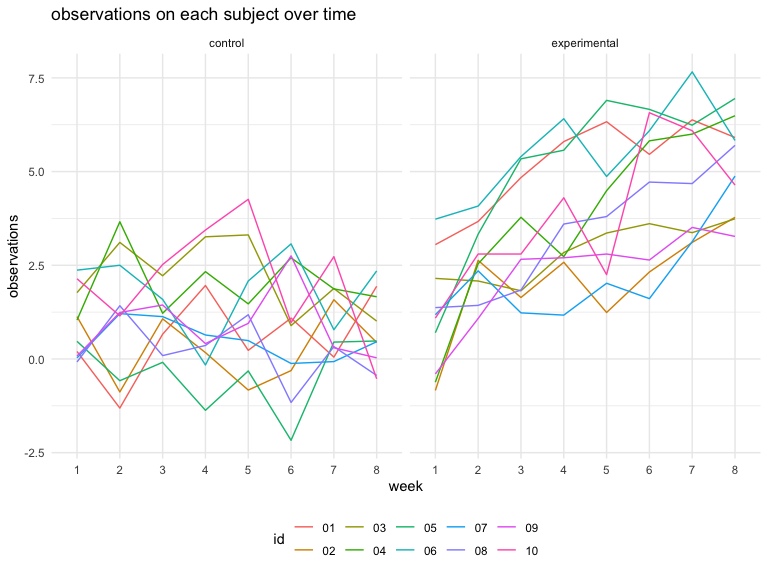
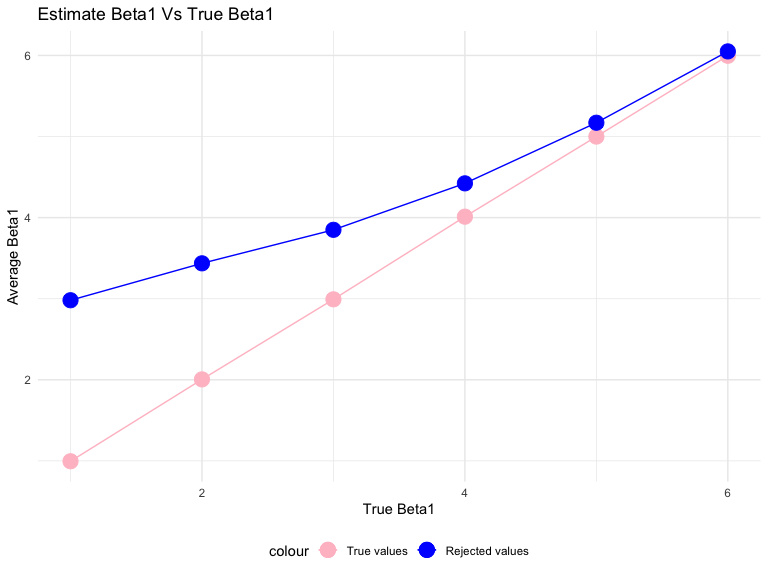

p8105\_hw5\_ys3298
================
Yimeng SHANG
11/1/2019

# PROBLEM1

``` r
#Write a function 
missing_value = function(vec) {
  if (is.numeric(vec)) {
    m = round(mean(vec, na.rm = TRUE), 1)
    output = vec %>% replace_na(m)
  } else if (is.character(vec)) {
    output = vec %>% replace_na("virginica")
  } else {
    stop("Error in type")
  }
  output
}

#Apply this function to the columns of iris_with_missing using a map statement
map(iris_with_missing, missing_value) %>%
  bind_cols()
```

    ## # A tibble: 150 x 5
    ##    Sepal.Length Sepal.Width Petal.Length Petal.Width Species
    ##           <dbl>       <dbl>        <dbl>       <dbl> <chr>  
    ##  1          5.1         3.5          1.4         0.2 setosa 
    ##  2          4.9         3            1.4         0.2 setosa 
    ##  3          4.7         3.2          1.3         0.2 setosa 
    ##  4          4.6         3.1          1.5         1.2 setosa 
    ##  5          5           3.6          1.4         0.2 setosa 
    ##  6          5.4         3.9          1.7         0.4 setosa 
    ##  7          5.8         3.4          1.4         0.3 setosa 
    ##  8          5           3.4          1.5         0.2 setosa 
    ##  9          4.4         2.9          1.4         0.2 setosa 
    ## 10          4.9         3.1          3.8         0.1 setosa 
    ## # … with 140 more rows

# PROBLEM2

``` r
# create a tidy dataframe
filename = list.files("./data") 
data_path = paste("./data", filename, sep = "/")

names = data_frame(filename = filename)

data =
  data_path %>%
  map(read_csv) %>%     
  reduce(rbind) %>% 
  cbind(names) %>% 
  separate(col = filename, into = c("group","ID_csv"), sep = "_") %>% 
  mutate(ID = str_replace(ID_csv,".csv","")) %>% 
  select(group, ID, everything()) %>% 
  select(-ID_csv) %>% 
  janitor::clean_names() 

data %>%  knitr::kable()
```

| group | id | week\_1 | week\_2 | week\_3 | week\_4 | week\_5 | week\_6 | week\_7 | week\_8 |
| :---- | :- | ------: | ------: | ------: | ------: | ------: | ------: | ------: | ------: |
| con   | 01 |    0.20 |  \-1.31 |    0.66 |    1.96 |    0.23 |    1.09 |    0.05 |    1.94 |
| con   | 02 |    1.13 |  \-0.88 |    1.07 |    0.17 |  \-0.83 |  \-0.31 |    1.58 |    0.44 |
| con   | 03 |    1.77 |    3.11 |    2.22 |    3.26 |    3.31 |    0.89 |    1.88 |    1.01 |
| con   | 04 |    1.04 |    3.66 |    1.22 |    2.33 |    1.47 |    2.70 |    1.87 |    1.66 |
| con   | 05 |    0.47 |  \-0.58 |  \-0.09 |  \-1.37 |  \-0.32 |  \-2.17 |    0.45 |    0.48 |
| con   | 06 |    2.37 |    2.50 |    1.59 |  \-0.16 |    2.08 |    3.07 |    0.78 |    2.35 |
| con   | 07 |    0.03 |    1.21 |    1.13 |    0.64 |    0.49 |  \-0.12 |  \-0.07 |    0.46 |
| con   | 08 |  \-0.08 |    1.42 |    0.09 |    0.36 |    1.18 |  \-1.16 |    0.33 |  \-0.44 |
| con   | 09 |    0.08 |    1.24 |    1.44 |    0.41 |    0.95 |    2.75 |    0.30 |    0.03 |
| con   | 10 |    2.14 |    1.15 |    2.52 |    3.44 |    4.26 |    0.97 |    2.73 |  \-0.53 |
| exp   | 01 |    3.05 |    3.67 |    4.84 |    5.80 |    6.33 |    5.46 |    6.38 |    5.91 |
| exp   | 02 |  \-0.84 |    2.63 |    1.64 |    2.58 |    1.24 |    2.32 |    3.11 |    3.78 |
| exp   | 03 |    2.15 |    2.08 |    1.82 |    2.84 |    3.36 |    3.61 |    3.37 |    3.74 |
| exp   | 04 |  \-0.62 |    2.54 |    3.78 |    2.73 |    4.49 |    5.82 |    6.00 |    6.49 |
| exp   | 05 |    0.70 |    3.33 |    5.34 |    5.57 |    6.90 |    6.66 |    6.24 |    6.95 |
| exp   | 06 |    3.73 |    4.08 |    5.40 |    6.41 |    4.87 |    6.09 |    7.66 |    5.83 |
| exp   | 07 |    1.18 |    2.35 |    1.23 |    1.17 |    2.02 |    1.61 |    3.13 |    4.88 |
| exp   | 08 |    1.37 |    1.43 |    1.84 |    3.60 |    3.80 |    4.72 |    4.68 |    5.70 |
| exp   | 09 |  \-0.40 |    1.08 |    2.66 |    2.70 |    2.80 |    2.64 |    3.51 |    3.27 |
| exp   | 10 |    1.09 |    2.80 |    2.80 |    4.30 |    2.25 |    6.57 |    6.09 |    4.64 |

``` r
clean_data = data %>% 
  pivot_longer(
    week_1:week_8,
    names_to = "week",
    names_prefix ="week_",
    values_to = "observations"
  )
```

``` r
# plot
clean_data %>% 
  ggplot(aes(x = week, y = observations)) + geom_line(aes(group = id,color = id)) + labs(title = "observations on each subject over time") +
  facet_grid(.~group)
```



From the plots, we can see the overall observations in experimental
group are higher than the control group and the observation for each day
in a week flactuate a lot but basiclly remains at the same level for
control group, wheras increases for observation group.

# PROBLEM3

``` r
set.seed(1)

model = function(beta1 = 0) {
  x = rnorm(30, 0, 1)
  epi = rnorm(30, 0, sd = sqrt(50))
  y = 2 + beta1 * x + epi
  data = tibble(x = x, y = y)
  
  ls_fit = lm(y ~ x, data) %>% 
    broom::tidy()
  
  return(tibble(beta1 = pull(ls_fit,estimate)[[2]], p = pull(ls_fit,p.value)[[2]]))
}

n = 10000

sim_results = 
  rerun(n, model(0)) %>%  ## rerun
  bind_rows()

sim_all = 
  tibble(beta1_true = c(1, 2, 3, 4, 5, 6)) %>% 
  mutate(
    output_list = map(.x = beta1_true, ~rerun(n, model(beta1 = .x)))) %>% 
  unnest %>% 
  unnest
```

``` r
proportion =
  sim_all %>% 
  filter(p < 0.05) %>% 
  group_by(beta1_true) %>% 
  summarize(proportion = n()/n) 

proportion %>% 
  ggplot(aes(x = beta1_true, y = proportion)) + geom_point(color = "blue", size = 5) + geom_line(color = "blue") +
  labs(x = "beta1", y = "Power(proportion of reject)", title = "Association between effect size and power")
```


**Describe the association between effect size and power:** Form the
plot, we can see there is a linear relationship between power and size
effect. Power increases with the increase of size effect.

``` r
beta1_true_average = 
  sim_all %>% 
  group_by(beta1_true) %>% 
  summarize(average = mean(beta1)) 

beta1_reject_average =
  sim_all %>% 
  filter(p<0.05) %>% 
  group_by(beta1_true) %>% 
  summarize(average_reject = mean(beta1)) 

all_info = left_join(beta1_true_average,beta1_reject_average) 
```

    ## Joining, by = "beta1_true"

``` r
all_info %>% 
  ggplot(aes(x = beta1_true)) + 
  geom_point(aes(y = average), size = 5, color = "pink") +
  geom_line(aes(y = average, color = "pink")) + 
  geom_point(aes(y = average_reject), size = 5, color = "blue") +
  geom_line(aes(y = average_reject), color = "blue") +
  scale_color_identity(breaks = c("pink", "blue"),
                       labels = c("True values", "Rejected values"),
                       guide = "legend") +
  labs(
    title = "Estimate Beta1 Vs True Beta1",
    x = "True Beta1",
    y = "Average Beta1"
  ) 
```



The sample average of beta1\_hat across tests for which the null is
rejected is not approximately equal to the true value of beta1.

Because the null here is beta1 = 0. When we reject the null, we get
result from beta1 not equal to 0. As the real beta 1 increases, the
difference between these two will converge.
